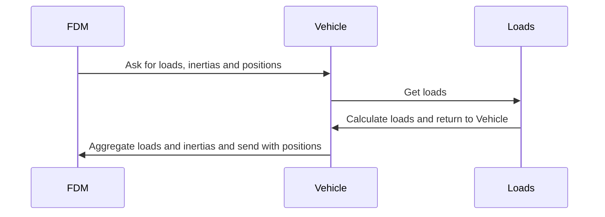

# flightdynamics

## Diagram

```mermaid
sequenceDiagram
    participant FDM
    participant Vehicle 
    participant Loads 
	
	FDM->>Vehicle: Ask for loads, inertias and positions
	Vehicle->>Loads: Get loads
	Loads->>Vehicle: Calculate loads and return to Vehicle
	Vehicle->>FDM: Aggregate loads and inertias and send with positions 
```
